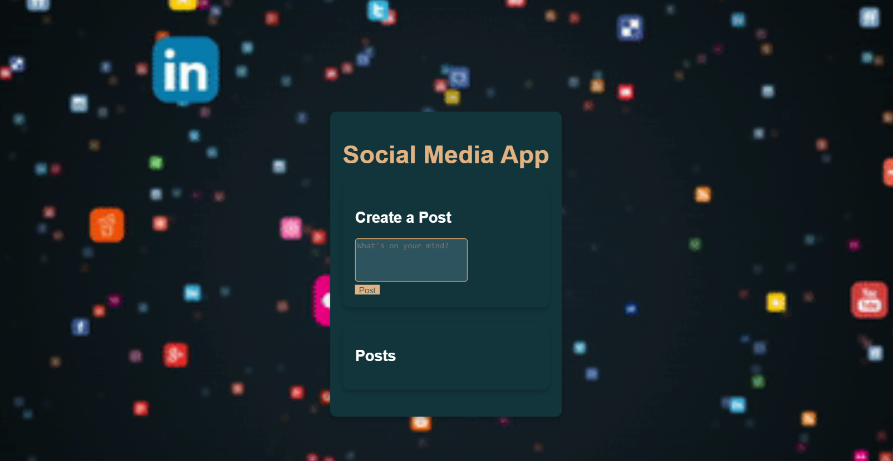

# Social Media App

This project is a basic social media application where users can create profiles, share posts, like, and comment on others' posts. It includes functionalities for users to follow each other, receive notifications for new interactions, and explore trending content.

### Prerequisites

- Node.js
- PostgreSQL

